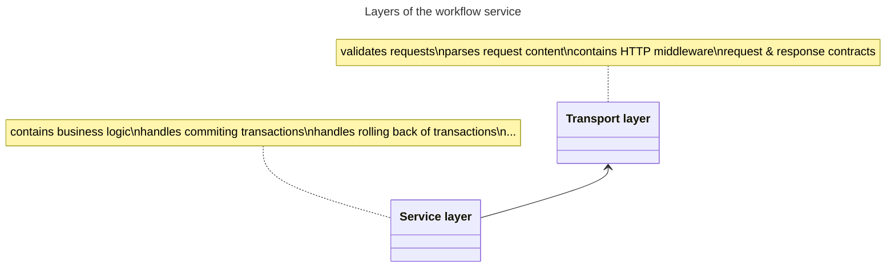

    

# User service
A repository with a service for managing users. This repository is part of [Microservices Reference Framework](https://github.com/MichalMoudry/microservices-reference-framework "Link to Microservices Reference Framework").

## Project structure
- **/src** - Folder with all the source/test code related to this service.
    - /cmd - Folder with service's entrypoints.
    - /internal
        - /transport
        - /service
        - /config
- **/.dapr** - Folder with Dapr components for local deployment.
- **/.azure** - Folder containing definitions for Azure resources.
- **/assets** - Folder with repository's assets that are not part of the source code.

### Service architecture
This section describes architecture of this particular service and not the entire system.

**Note**: Arrows in the diagram below display direction of dependencies between layers. This project utilises Inversion of Control pattern for many component, layers including.

**Note**: This is a stateless service, so there is no persistance layer/database.

## Getting started

## Used technologies
